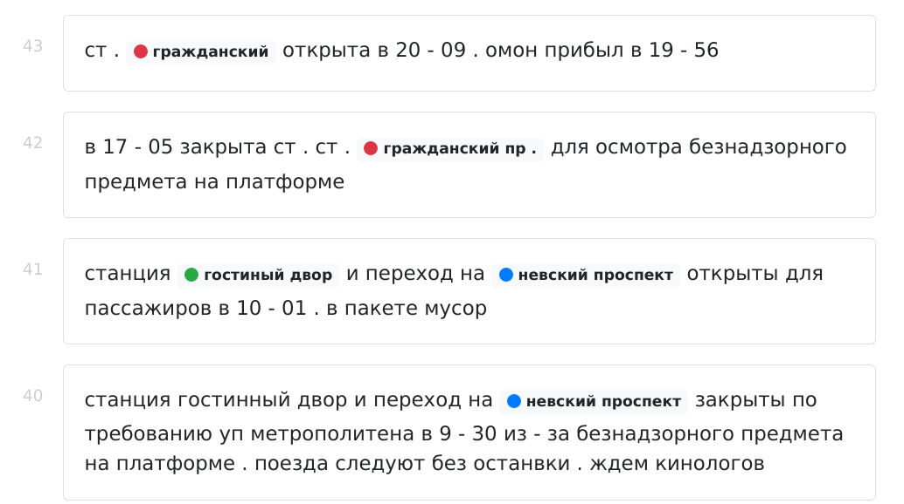

Here is a page, that displays all messages from the `@spbmetro` telegram channel. If there is a metro station name there, it will be highlighted.



Parsing is made on the backend, to run it do:

```
$ pipenv install
$ pipenv run python server.py
```
